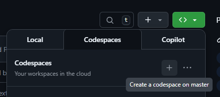
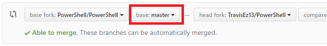

# Contributing to PowerShell

We welcome and appreciate contributions from the community!

There are many ways to become involved with PowerShell including:

- [Contributing to Documentation](#contributing-to-documentation)
- [Contributing to Issues](#contributing-to-issues)
- [Contributing to Code](#contributing-to-code)

Please read the rest of this document to ensure a smooth contribution process.

## Contributing to Documentation

Contributing to the docs is an excellent way to get started with the process of making open source contributions with minimal technical skill required.

Please see the [Contributor Guide in `MicrosoftDocs/PowerShell-Docs`](https://aka.ms/PSDocsContributor).

Learn how to [Contribute to Docs like a Microsoft Insider](https://www.youtube.com/watch?v=ZQODV8krq1Q) (by @sdwheeler)

### Updating Documentation for an existing cmdlet

If you made a change to an existing cmdlet and would like to update the documentation using PlatyPS,
here are the quick steps:

1. Install
`PlatyPS`
if you don't have it -
`Install-Module PlatyPS`.
1. Clone the
[`MicrosoftDocs/PowerShell-Docs`](https://github.com/MicrosoftDocs/PowerShell-Docs)
repository if you don't already have it.
1. Start your local build of PowerShell
(with the change to the cmdlet you made).
1. Find the cmdlet's Markdown file in PowerShell Docs - usually under
`PowerShell-Docs/reference/<latest powershell version>/<module cmdlet is a part of>/<your changed cmdlet>.md`
(Ex. `PowerShell-Docs/reference/7/Microsoft.PowerShell.Utility/Select-String.md`)
1. Run
`Update-MarkdownHelp -Path <path to cmdlet Markdown file>`
which will update the documentation for you.
1. Make any additional changes needed for the cmdlet to be properly documented.
1. Send a Pull Request to the PowerShell Docs repository with the changes that
`PlatyPS`
made.
1. Link your Docs PR to your original change PR.

### Style notes for documentation related to maintaining or contributing to the PowerShell project

* When writing Markdown documentation, use [semantic linefeeds][].
  In most cases, it means "one clause/idea per line".
* Otherwise, these issues should be treated like any other issue in this repository.

### Spell checking documentation

Documentation is spellchecked. We use the
[textlint](https://github.com/textlint/textlint/wiki/Collection-of-textlint-rule) command-line tool,
which can be run in interactive mode to correct typos.

To run the spell checker, follow these steps:

* install [Node.js](https://nodejs.org/en/) (v10 or up)
* install [textlint](https://github.com/textlint/textlint/wiki/Collection-of-textlint-rule) by
  `npm install -g textlint textlint-rule-terminology`
* run `textlint --rule terminology <changedFileName>`,
  adding `--fix` will accept all the recommendations.

If you need to add a term or disable checking part of a file see the [configuration sections of the rule](https://github.com/sapegin/textlint-rule-terminology).

### Checking links in documentation

Documentation is link-checked. We make use of the
`markdown-link-check` command-line tool,
which can be run to see if any links are dead.

To run the link-checker, follow these steps:

* install [Node.js](https://nodejs.org/en/) (v10 or up)
* install `markdown-link-check` by
  `npm install -g markdown-link-check@3.8.5`
* run `find . \*.md -exec markdown-link-check {} \;`

## Contributing to Issues

1. Review [Issue Management][issue-management].
1. Check if the issue you are going to file already exists in our [GitHub issues][open-issue].
1. If you can't find your issue already,
  [open a new issue](https://github.com/PowerShell/PowerShell/issues/new/choose),
  making sure to follow the directions as best you can.
1. If the issue is marked as [`Up-for-Grabs`][up-for-grabs],
  the PowerShell Maintainers are looking for help with the issue.
1. Issues marked as [`First-Time-Issue`][first-time-issue],
  are identified as being easy and a great way to learn about this project and making
  contributions.
  
### Finding or creating an issue

1. Follow the instructions in [Contributing to Issues][contribute-issues] to find or open an issue.
1. Mention in the issue that you are working on the issue and ask `@powershell/powershell` for an assignment.

### Forks and Pull Requests

GitHub fosters collaboration through the notion of [pull requests][using-prs].
On GitHub, anyone can [fork][fork-a-repo] an existing repository
into their own user account, where they can make private changes to their fork.
To contribute these changes back into the original repository,
a user simply creates a pull request in order to "request" that the changes be taken "upstream".

Additional references:

* GitHub's guide on [forking](https://guides.github.com/activities/forking/)
* GitHub's guide on [Contributing to Open Source](https://guides.github.com/activities/contributing-to-open-source/#pull-request)
* GitHub's guide on [Understanding the GitHub Flow](https://guides.github.com/introduction/flow/)

## Contributing to Code

### Quick Start Checklist

* Review the [Contributor License Agreement][CLA] requirement.
* Get familiar with the [PowerShell Repository Git Concepts](../docs/git/README.md).
* Start a [GitHub Codespace](#Dev Container) and start exploring the repository.
* Consider if what you want to do might be implementable as a [PowerShell Binary Module](https://learn.microsoft.com/powershell/scripting/developer/module/how-to-write-a-powershell-binary-module?view=powershell-7.5).
  The PowerShell repository has a rigorous acceptance process due to its huge popularity and emphasis on stability and long term support, and with a binary module you can contribute to the community much more quickly.
* Pick an existing issue to work on! For instance, clarifying a confusing or unclear error message is a great starting point.

### Intro to Git and GitHub

1. Sign up for a [GitHub account](https://github.com/signup/free).
1. Learning Git and GitHub:
    - [Git Basics](../docs/git/basics.md): install and getting started
    - [Good Resources for Learning Git and GitHub][good-git-resources]
1. The PowerShell repository uses GitHub Flow as the primary branching strategy. [Learn about GitHub Flow](https://guides.github.com/introduction/flow/)

### Code Editing

PowerShell is primarily written in [C#](https://learn.microsoft.com/dotnet/csharp/tour-of-csharp/overview). While you can use any C# development environment you prefer, [Visual Studio Code][use-vscode-editor] is recommended.

### Dev Container

There is a PowerShell [Dev Container](https://code.visualstudio.com/docs/devcontainers/containers) which enables you get up and running quickly with a prepared Visual Studio Code environment with all the required prerequisites already installed.

[GitHub Codespaces](https://github.com/features/codespaces) is the fastest way to get started.
Codespaces allows you to start a Github-hosted devcontainer from anywhere and contribute from your browser or via Visual Studio Code remoting.
All GitHub users get 15 hours per month of a 4-core codespace for free.

To start a codespace for the PowerShell repository:

1. Go to https://github.com/PowerShell/PowerShell
1. Click the green button on the right and choose to create a codespace

   
1. Alternatively, just hit the comma `,` key on your keyboard which should instantly start a codespace as well.

Once the codespace starts, you can press `ctrl+shift+b` (`cmd+shift+b` on Mac) to run the default build task. If you would like to interactivey test your changes, you can press `F5` to start debugging, add breakpoints, etc.

[Learn more about how to get started with C# in Visual Studio Code](https://code.visualstudio.com/docs/csharp/get-started)

### Building and Testing

#### Building PowerShell

[Building PowerShell](../README.md#Building-Powershell) has instructions for various platforms.

#### Testing PowerShell

Please see PowerShell [Testing Guidelines - Running Tests Outside of CI][running-tests-outside-of-ci] on how to test your build locally.

### Lifecycle of a pull request

#### Before submitting

* If your change would fix a security vulnerability,
  first follow the [vulnerability issue reporting policy][vuln-reporting], before submitting a PR.
* To avoid merge conflicts, make sure your branch is rebased on the `master` branch of this repository.
* Many code changes will require new tests,
  so make sure you've added a new test if existing tests do not effectively test the code changed.
* Clean up your commit history.
  Each commit should be a **single complete** change.
  This discipline is important when reviewing the changes as well as when using `git bisect` and `git revert`.

#### Pull request - Submission

**Always create a pull request to the `master` branch of this repository**.



* It's recommended to avoid a PR with too many changes.
  A large PR not only stretches the review time, but also makes it much harder to spot issues.
  In such case, it's better to split the PR to multiple smaller ones.
  For large features, try to approach it in an incremental way, so that each PR won't be too big.
* If you're contributing in a way that changes the user or developer experience, you are expected to document those changes.
  See [Contributing to documentation related to PowerShell](#contributing-to-documentation).
* Add a meaningful title of the PR describing what change you want to check in.
  Don't simply put: "Fix issue #5".
  Also don't directly use the issue title as the PR title.
  An issue title is to briefly describe what is wrong, while a PR title is to briefly describe what is changed.
  A better example is: "Add Ensure parameter to New-Item cmdlet", with "Fix #5" in the PR's body.
* When you create a pull request,
  include a summary about your changes in the PR description.
  The description is used to create changelogs,
  so try to have the first sentence explain the benefit to end users.
  If the changes are related to an existing GitHub issue,
  please reference the issue in the PR description (e.g. ```Fix #11```).
  See [this][closing-via-message] for more details.

* Please use the present tense and imperative mood when describing your changes:
  * Instead of "Adding support for Windows Server 2012 R2", write "Add support for Windows Server 2012 R2".
  * Instead of "Fixed for server connection issue", write "Fix server connection issue".

  This form is akin to giving commands to the codebase
  and is recommended by the Git SCM developers.
  It is also used in the [Git commit messages](#common-engineering-practices).
* If the change is related to a specific resource, please prefix the description with the resource name:
  * Instead of "New parameter 'ConnectionCredential' in New-SqlConnection",
  write "New-SqlConnection: add parameter 'ConnectionCredential'".
* If your change warrants an update to user-facing documentation,
  a Maintainer will add the `Documentation Needed` label to your PR and add an issue to the [PowerShell-Docs repository][PowerShell-Docs],
  so that we make sure to update official documentation to reflect your contribution.
  As an example, this requirement includes any changes to cmdlets (including cmdlet parameters) and features which have associated about_* topics.
  While not required, we appreciate any contributors who add this label and create the issue themselves.
  Even better, all contributors are free to contribute the documentation themselves.
  (See [Contributing to documentation related to PowerShell](#contributing-to-documentation) for more info.)
* If your change adds a new source file, ensure the appropriate copyright and license headers is on top.
  It is standard practice to have both a copyright and license notice for each source file.
  * For `.cs` files use the copyright header with empty line after it:

    ```c#
        // Copyright (c) Microsoft Corporation.
        // Licensed under the MIT License.
        <Add empty line here>
    ```

  * For `.ps1` and `.psm1` files use the copyright header with empty line after it:

    ```powershell
        # Copyright (c) Microsoft Corporation.
        # Licensed under the MIT License.
        <Add empty line here>
    ```

* If your change adds a new module manifest (.psd1 file), ensure that:

  ```powershell
  Author = "PowerShell"
  Company = "Microsoft Corporation"
  Copyright = "Copyright (c) Microsoft Corporation."
  ```

  is at the top.

### Pull Request - Work in Progress

* If your pull request is not ready to merge, please add the prefix `WIP:` to the beginning of the title and remove the prefix when the PR is ready.

#### Pull Request - Automatic Checks

* If this is your first contribution to PowerShell,
  you may be asked to sign a [Contribution Licensing Agreement][CLA] (CLA)
  before your changes will be accepted.
* Make sure you follow the [Common Engineering Practices](#common-engineering-practices)
  and [testing guidelines](../docs/testing-guidelines/testing-guidelines.md).
* After submitting your pull request,
  our [CI system (Azure DevOps Pipelines)][ci-system]
  will run a suite of tests and automatically update the status of the pull request.
* A GitHub Actions workflow automatically verifies that all changed source files include the proper copyright header.
  If your PR fails the copyright check, add the appropriate copyright header to the beginning of each flagged file
  (see the copyright header examples above).
* Our CI contains automated spell checking and link checking for Markdown files. If there is any false-positive,
  [run the spell checker command-line tool in interactive mode](#spell-checking-documentation)
  to add words to the `.spelling` file.
* Our packaging test may not pass and ask you to update `files.wxs` file if you add/remove/update nuget package references or add/remove assert files.

  You could update the file manually in accordance with messages in the test log file. Or you can use automatically generated file. To get the file you should build the msi package locally:

  ```powershell
  Import-Module .\build.psm1
  Start-PSBuild -Clean -CrossGen -PSModuleRestore -Runtime win7-x64 -Configuration Release -ReleaseTag <release tag>
  Import-Module .\tools\packaging
  Start-PSPackage -Type msi -ReleaseTag <release tag> -WindowsRuntime 'win7-x64' -SkipReleaseChecks
  ```

  Last command will report where new file is located.

#### Pull Request - Workflow

1. The PR *author* creates a pull request from a fork.
1. The *author* ensures that their pull request passes the [CI system][ci-system] build.
   - If the build fails, a [Repository Maintainer][repository-maintainer] adds the `Review - waiting on author` label to the pull request.
   The *author* can then continue to update the pull request until the build passes.
1. If the *author* knows whom should participate in the review, they should add them otherwise they can add the recommended *reviewers*.
1. Once the build passes, if there is not sufficient review, the *maintainer* adds the `Review - needed` label.
1. An [Area Expert][area-expert] should also review the pull request.
   - If the *author* does not meet the *reviewer*'s standards, the *reviewer* makes comments. A *maintainer* then removes the `Review - needed` label and adds
   the `Review - waiting on author` label. The *author* must address the comments and repeat from step 2.
   - If the *author* meets the *reviewer*'s standards, the *reviewer* approves the PR. A maintainer then removes the `need review` label.
1. Once the code review is completed, a *maintainer* merges the pull request after one business day to allow for additional critical feedback.

#### Pull Request - Roles and Responsibilities

1. The PR *author* is responsible for moving the PR forward to get it approved.
   This includes addressing feedback within a timely period and indicating feedback has been addressed by adding a comment and mentioning the specific *reviewers*.
   When updating your pull request, please **create new commits** and **don't rewrite the commits history**.
   This way it's very easy for the reviewers to see diff between iterations.
   If you rewrite the history in the pull request, review could be much slower.
   The PR is likely to be squash-merged to master by the *assignee*.
1. *Reviewers* are anyone who wants to contribute.
   They are responsible for ensuring the code: addresses the issue being fixed, does not create new issues (functional, performance, reliability, or security), and implements proper design.
   *Reviewers* should use the `Review changes` drop down to indicate they are done with their review.
   - `Request changes` if you believe the PR merge should be blocked if your feedback is not addressed,
   - `Approve` if you believe your feedback has been addressed or the code is fine as-is, it is customary (although not required) to leave a simple "Looks good to me" (or "LGTM") as the comment for approval.
   - `Comment` if you are making suggestions that the *author* does not have to accept.
   Early in the review, it is acceptable to provide feedback on coding formatting based on the published [Coding Guidelines][coding-guidelines], however,
   after the PR has been approved, it is generally *not* recommended to focus on formatting issues unless they go against the [Coding Guidelines][coding-guidelines].
   Non-critical late feedback (after PR has been approved) can be submitted as a new issue or new pull request from the *reviewer*.
1. *Assignees* who are always *Maintainers* ensure that proper review has occurred and if they believe one approval is not sufficient, the *maintainer* is responsible to add more reviewers.
   An *assignee* may also be a reviewer, but the roles are distinct.
   Once the PR has been approved and the CI system is passing, the *assignee* will merge the PR after giving one business day for any critical feedback.
   For more information on the PowerShell Maintainers' process, see the [documentation](../docs/maintainers).

#### Pull Requests - Abandoned

A pull request with the label `Review - waiting on author` for **more than two weeks** without a word from the author is considered abandoned.

In these cases:

1. *Assignee* will ping the author of PR to remind them of pending changes.
   - If the *author* responds, it's no longer an abandoned; the pull request proceeds as normal.
1. If the *author* does not respond **within a week**:
   - If the *reviewer*'s comments are very minor, merge the change, fix the code immediately, and create a new PR with the fixes addressing the minor comments.
   - If the changes required to merge the pull request are significant but needed, *assignee* creates a new branch with the changes and open an issue to merge the code into the dev branch.
   Mention the original pull request ID in the description of the new issue and close the abandoned pull request.
   - If the changes in an abandoned pull request are no longer needed (e.g. due to refactoring of the codebase or a design change), *assignee* will simply close the pull request.

### Making Breaking Changes

When you make code changes,
please pay attention to these that can affect the [Public Contract][breaking-changes-contract].
For example, changing PowerShell parameters, APIs, or protocols break the public contract.
Before making changes to the code,
first review the [breaking changes contract][breaking-changes-contract]
and follow the guidelines to keep PowerShell backward compatible.

### Making Design Changes

To add new features such as cmdlets or making design changes,
please follow the [PowerShell Request for Comments (RFC)][rfc-process] process.

### Common Engineering Practices

Other than the guidelines for [coding][coding-guidelines],
the [RFC process][rfc-process] for design,
[documentation](#contributing-to-documentation) and [testing](../docs/testing-guidelines/testing-guidelines.md) discussed above,
we encourage contributors to follow these common engineering practices:

* Format commit messages following these guidelines:

```text
Summarize change in 50 characters or less

Similar to email, this is the body of the commit message,
and the above is the subject.
Always leave a single blank line between the subject and the body
so that `git log` and `git rebase` work nicely.

The subject of the commit should use the present tense and
imperative mood, like issuing a command:

> Makes abcd do wxyz

The body should be a useful message explaining
why the changes were made.

If significant alternative solutions were available,
explain why they were discarded.

Keep in mind that the person most likely to refer to your commit message
is you in the future, so be detailed!

As Git commit messages are most frequently viewed in the terminal,
you should wrap all lines around 72 characters.

Using semantic line feeds (breaks that separate ideas)
is also appropriate, as is using Markdown syntax.
```

* These are based on Tim Pope's [guidelines](https://tbaggery.com/2008/04/19/a-note-about-git-commit-messages.html),
  Git SCM [submitting patches](https://git.kernel.org/cgit/git/git.git/tree/Documentation/SubmittingPatches),
  Brandon Rhodes' [semantic linefeeds][],
  and John Gruber's [Markdown syntax](https://daringfireball.net/projects/markdown/syntax).
* Don't commit code that you didn't write.
  If you find code that you think is a good fit to add to PowerShell,
  file an issue and start a discussion before proceeding.
* Create and/or update tests when making code changes.
* Run tests and ensure they are passing before opening a pull request.
* All pull requests **must** pass CI systems before they can be approved.
* Avoid making big pull requests.
  Before you invest a large amount of time,
  file an issue and start a discussion with the community.

### Contributor License Agreement (CLA)

To speed up the acceptance of any contribution to any PowerShell repositories,
you should sign the Microsoft [Contributor License Agreement (CLA)](https://cla.microsoft.com/) ahead of time.
If you've already contributed to PowerShell or Microsoft repositories in the past, congratulations!
You've already completed this step.
This a one-time requirement for the PowerShell project.
Signing the CLA process is simple and can be done in less than a minute.
You don't have to do this up-front.
You can simply clone, fork, and submit your pull request as usual.
When your pull request is created, it is checked by the CLA bot.
If you have signed the CLA, the status check will be set to `passing`.  Otherwise, it will stay at `pending`.
Once you sign a CLA, all your existing and future pull requests will have the status check automatically set at `passing`.

## Code of Conduct Enforcement

Reports of abuse will be reviewed by the [PowerShell Committee][ps-committee] and if it has been determined that violations of the
[Code of Conduct](../CODE_OF_CONDUCT.md) has occurred, then a temporary ban may be imposed.
The duration of the temporary ban will depend on the impact and/or severity of the infraction.
This can vary from 1 day, a few days, a week, and up to 30 days.
Repeat offenses may result in a permanent ban from the PowerShell org.

[running-tests-outside-of-ci]: ../docs/testing-guidelines/testing-guidelines.md#running-tests-outside-of-ci
[issue-management]: ../docs/maintainers/issue-management.md
[vuln-reporting]: ./SECURITY.md
[using-prs]: https://help.github.com/articles/using-pull-requests/
[fork-a-repo]: https://help.github.com/articles/fork-a-repo/
[closing-via-message]: https://help.github.com/articles/closing-issues-via-commit-messages/
[CLA]: #contributor-license-agreement-cla
[ci-system]: ../docs/testing-guidelines/testing-guidelines.md#ci-system
[good-git-resources]: https://help.github.com/articles/good-resources-for-learning-git-and-github/
[contribute-issues]: #contributing-to-issues
[open-issue]: https://github.com/PowerShell/PowerShell/issues
[up-for-grabs]: https://github.com/powershell/powershell/issues?q=is%3Aopen+is%3Aissue+label%3AUp-for-Grabs
[semantic linefeeds]: https://rhodesmill.org/brandon/2012/one-sentence-per-line/
[PowerShell-Docs]: https://github.com/powershell/powershell-docs/
[use-vscode-editor]: https://learn.microsoft.com/dotnet/core/tutorials/with-visual-studio-code
[repository-maintainer]: ../docs/community/governance.md#repository-maintainers
[area-expert]: ../.github/CODEOWNERS
[first-time-issue]: https://github.com/powershell/powershell/issues?q=is%3Aopen+is%3Aissue+label%3AFirst-Time-Issue
[coding-guidelines]: ../docs/dev-process/coding-guidelines.md
[breaking-changes-contract]: ../docs/dev-process/breaking-change-contract.md
[rfc-process]: https://github.com/PowerShell/PowerShell-RFC
[ps-committee]: ../docs/community/governance.md#powershell-committee
