# Building a C# Cmdlet with Visual Studio

This document describes steps for building a C# Cmdlet with Visual Studio in 2 ways:

* [Building a C# Cmdlet for PowerShell Core](#building-a-c-cmdlet-for-powershell-core-with-visual-studio)
* [Building a C# Cmdlet for PowerShell Standard 3.0](#building-a-c-cmdlet-for-powershell-standard-30-with-visual-studio)

## Building a C# Cmdlet for PowerShell Core with Visual Studio

This demonstrates how to build your own C# cmdlet for PowerShell Core with Visual Studio.
Targeting for PowerShell Core means that the cmdlet may not work against Windows PowerShell if you take dependencies on new APIs introduced in PowerShell Core.

We will use the free [Visual Studio Community 2017](https://www.visualstudio.com/downloads).

1. When installing Visual Studio 2017 select `.NET Core cross-platform development` under `Other Toolsets`
  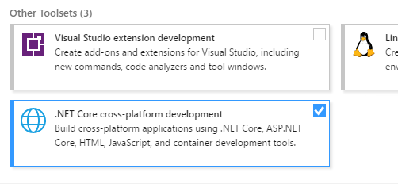

1. Create new C# project `SendGreeting` of type `Class Library (.NET Core)`
  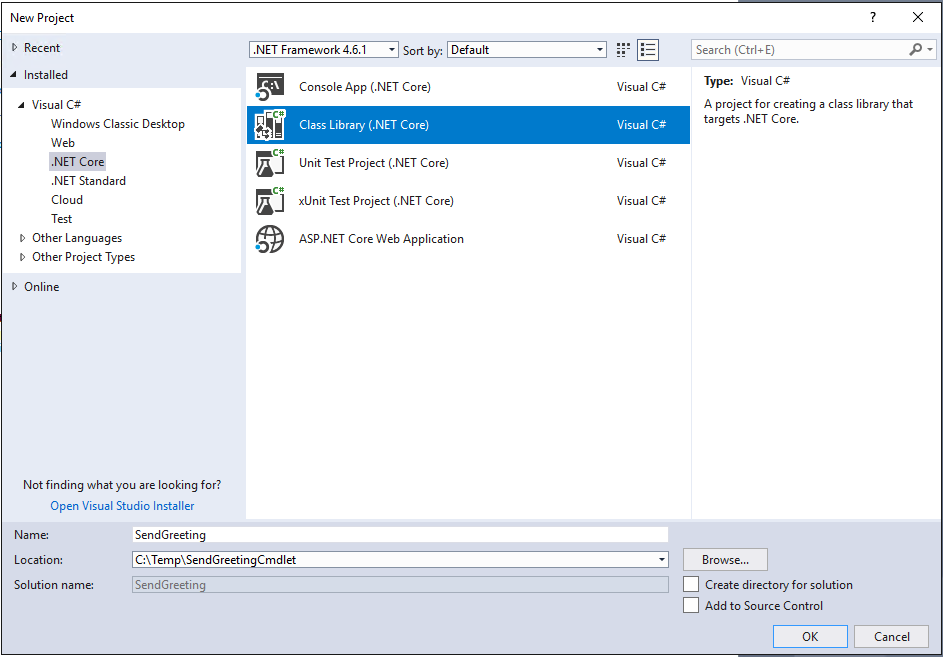

1. Now we need to setup PowerShell Core reference assemblies.
  In `Solution Explorer` right click on project `Dependencies` and select `Manage NuGet Packages...`
In the top-right corner of the package manager click on the small `Settings` sprocket icon that is to the right from `Package source` dropdown.
By default, there will be only `nuget.org` package source in `Available package sources` list.
Add another package source with name `powershell-core` and source `https://powershell.myget.org/F/powershell-core/api/v3/index.json`
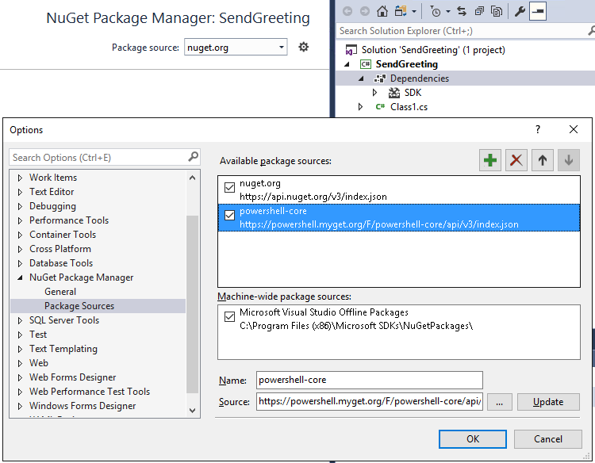

1. In the package manager select new `powershell-core` in `Package source` dropdown, select `Browse` tab, type in `System.Management.Automation` in the search and select `Include prerelease`.
  It should find `System.Management.Automation` package, select it and it will show package details; install it using `Install` button.
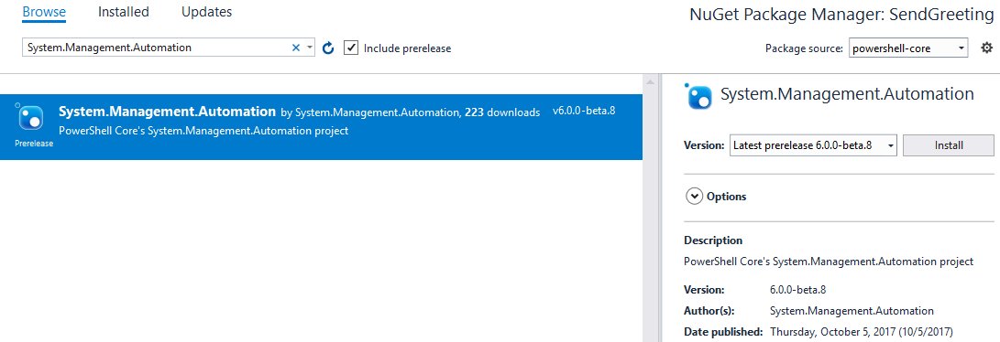

1. Add the code of cmdlet:

    ```csharp
    using System.Management.Automation;  // PowerShell namespace.

    namespace SendGreeting
    {
        // Declare the class as a cmdlet and specify and
        // appropriate verb and noun for the cmdlet name.
        [Cmdlet(VerbsCommunications.Send, "Greeting")]
        public class SendGreetingCommand : Cmdlet
        {
            // Declare the parameters for the cmdlet.
            [Parameter(Mandatory = true)]
            public string Name { get; set; }

            // Overide the ProcessRecord method to process
            // the supplied user name and write out a
            // greeting to the user by calling the WriteObject
            // method.
            protected override void ProcessRecord()
            {
                WriteObject("Hello " + Name + "!");
            }
        }
    }
    ```

    At this point everything should look like this:
    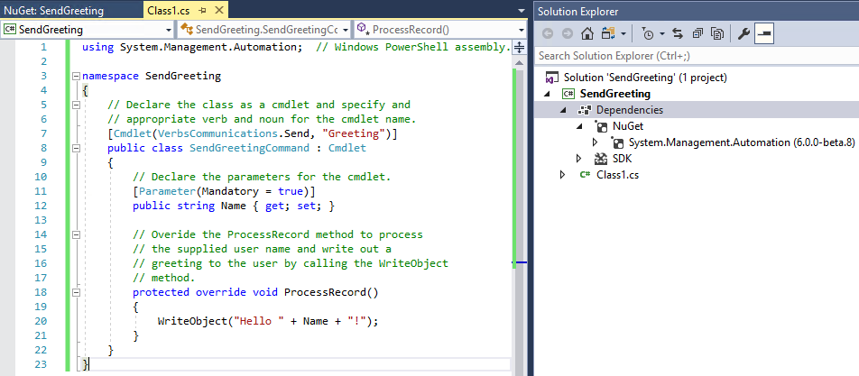

1. Build solution (F6); The `Output` window will print the location of generated cmdlet DLL:
  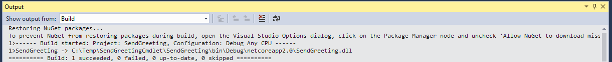

1. Start PowerShell Core, run `Import-Module` on DLL path from previous step and run cmdlet:
  
You can also run the same cmdlet on Linux and other systems that PowerShell Core supports:
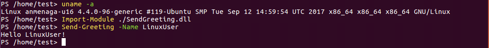

## Building a C# Cmdlet for PowerShell Standard 3.0 with Visual Studio

Steps below show how to build your own C# cmdlet for PowerShell Standard 3.0 with Visual Studio.
Targeting PowerShell Standard 3.0 means that the same module will work against PowerShell Core as well as Windows PowerShell v3 and newer,
however, you are limited to a subset of the available PowerShell APIs.

We will use the free [Visual Studio Community 2017](https://www.visualstudio.com/downloads).

1. When installing Visual Studio 2017 select `.NET Core cross-platform development` under `Other Toolsets`
  

1. Create new C# project `SendGreetingStd` of type `Class Library (.NET Standard)`
  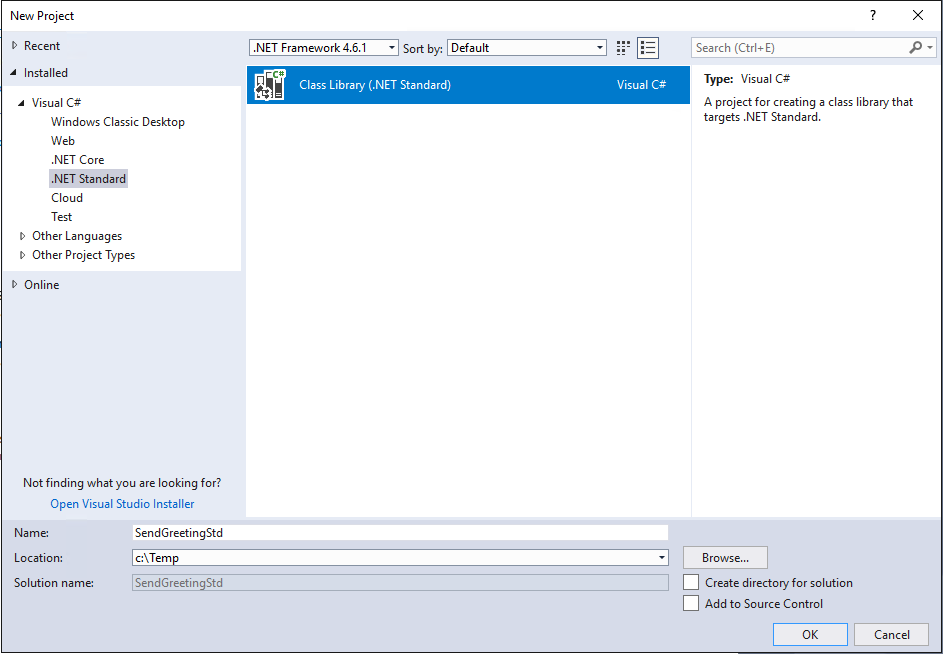

1. On project properties verify that `Target framework` is `.NET Standard 2.0`:<br />
  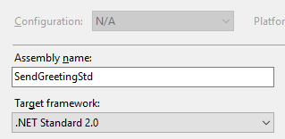

1. Now we need to setup reference assemblies.
  In `Solution Explorer` right click on project `Dependencies` and select `Manage NuGet Packages...`
In the top-right corner of the package manager select `nuget.org` package source, select `Browse` tab, type in `PowerShellStandard.Library` in the search and select `Include prerelease`.
It should find `PowerShellStandard.Library` package, select it and it will show package details; install it using `Install` button.
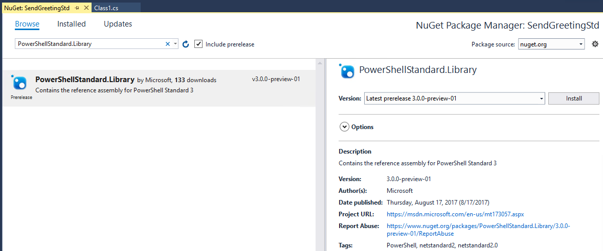

1. Add the code of cmdlet:

    ```csharp
    using System.Management.Automation;  // PowerShell namespace.

    namespace SendGreeting
    {
        // Declare the class as a cmdlet and specify and
        // appropriate verb and noun for the cmdlet name.
        [Cmdlet(VerbsCommunications.Send, "Greeting")]
        public class SendGreetingCommand : Cmdlet
        {
            // Declare the parameters for the cmdlet.
            [Parameter(Mandatory = true)]
            public string Name { get; set; }

            // Overide the ProcessRecord method to process
            // the supplied user name and write out a
            // greeting to the user by calling the WriteObject
            // method.
            protected override void ProcessRecord()
            {
                WriteObject("Hello " + Name + "!");
            }
        }
    }
    ```

    At this point everything should look like this:
    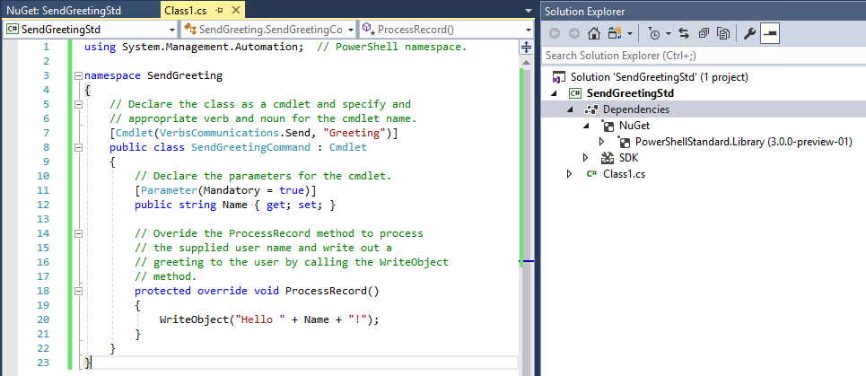

1. Build solution (F6); The `Output` window will print the location of generated cmdlet DLL:
  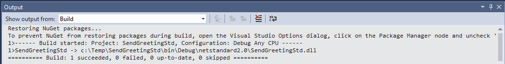

1. Now cmdlet can be run on systems supported by PowerShell Standard;<br />
  For example:<br />
  On PowerShell Core on Windows:
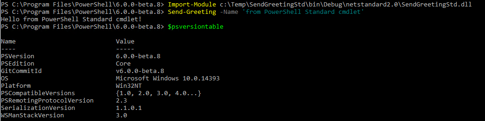
On PowerShell Core on Linux:
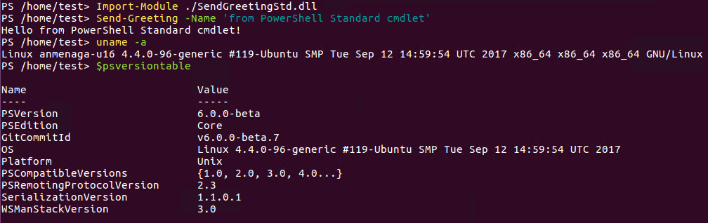
On Windows PowerShell on Windows (this requires [.NET Framework 4.7.1](https://github.com/Microsoft/dotnet-framework-early-access/blob/master/instructions.md)):
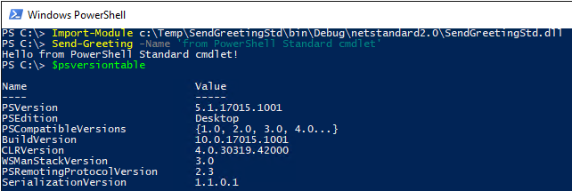
