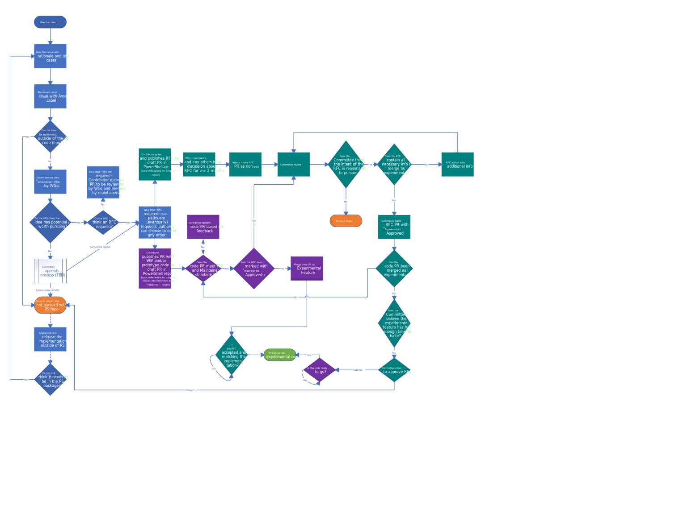

# Working Groups

Working Groups (WGs) are collections of contributors with knowledge of specific components or
technologies in the PowerShell domain.
They are responsible for issue triage/acceptance, code reviews, and providing their expertise to
others in issues, PRs, and RFC discussions.

The list, description, and membership of the existing Working Groups is available
[here](working-group-definitions.md).

## Terms

* **Contributor** is used interchangeably within this doc as anyone participating in issues or
  contributing code, RFCs, documentations, tests, bug reports, etc.,
  regardless of their status with the PowerShell project.
* **Repository Maintainers** are trusted stewards of the PowerShell repository responsible for
  maintaining consistency and quality of PowerShell code.
  One of their primary responsibilities is merging pull requests after all requirements have been fulfilled.
  (Learn more about the Repository Maintainers [here](https://github.com/PowerShell/PowerShell/tree/master/docs/maintainers).)
* The **PowerShell Committee** is responsible for the design and governance of the PowerShell project,
  primarily by voting to accept or reject review-for-comment (RFC) documents.
  (Learn more about the PowerShell Committee [here](https://github.com/PowerShell/PowerShell/blob/master/docs/community/governance.md#powershell-committee).)
* A **Working Group** is a collection of people responsible for providing expertise on a specific
  area of PowerShell in order to help establish consensus within the community and Committee.
  The responsibilities of Working Groups are outlined below.
  (Note: while some experts within Working Groups may have more specific expertise in a sub-topic
  of the team,
  the intent is that each team is holistically and collectively responsible for making decisions
  within the larger topic space.)

## Goals

In designing the WG process, the Committee had a few goals:

1. Increase the velocity of innovation without compromising the stability of PowerShell
1. Reduce the time spent by contributors on writing/reviewing PRs and RFCs that are not feasible
1. Increase the formal authority of subject matter experts (SMEs) inside and outside of Microsoft
1. Decrease the volume of required technical discussions held by the Committee

## Process

This process is represented within the [`process_diagram.vsdx` Visio diagram](process_diagram.vsdx):

1. A contributor has an idea for PowerShell
1. The contributor files an issue informally describing the idea,
   including some rationale as to why it should happen and a few use cases to show how it could work,
   as well as to determine viability and value to the community.
   This should include examples of expected input and output so that others understand how the feature would function in the real world.
1. The issue gets triaged into an [Area label](https://github.com/PowerShell/PowerShell/blob/master/docs/maintainers/issue-management.md#feature-areas)
   by Maintainers.
   This area label maps to one or more Working Groups.
1. If the Working Group determines that an idea can be prototyped or built outside of the PowerShell repo
   (e.g. as a module),
   contributors should start that idea outside of the PowerShell project.
   Given that the issue is no longer directly relevant to the PowerShell project, it should be closed
   (with a link to the new project, if available).
   If the implementation turns out to be successful and particularly popular,
   and a contributor believes that it would be overwhelmingly valuable to include in the primary PowerShell package,
   they can restart the process in a new issue proposing that the functionality be
   incorporated directly into the primary PowerShell package.
1. After the issue is filed, interested contributors should discuss the
   feasibility and approach of the idea in the issue.
   The Working Group that owns that Area is expected to contribute to this discussion.
   Working groups may have their own criteria to consider in their areas.
1. After an appropriately exhaustive discussion/conversation
   (i.e. the Working Group has determined that no new arguments are being made),
   the Working Group makes a call on whether they believe the idea should continue through this process.
   Note: this should be done via a best effort of consensus among the Working Group.
   We don't currently have hard requirements for how this should be done,
   but some ideas include:

   * a single member of the Working Group makes a proposal as a comment and other members should
     "react" on GitHub with up/down thumbs
   * Working Groups communicate privately through their own established channel to reach consensus

   It's worth noting that Working Group members who repeatedly speak on behalf of the Working Group without
   consensus, they may be censured or removed from the team.

### Working Groups reject the proposal

If the Working Group says the idea should not pursued, the process stops.
Some reasons for rejection include (but are not limited to):

* the idea can be implemented and validated for usefulness and popularity outside of the primary PowerShell repo/package
* the idea is difficult/impossible to implement
* the implementation would introduce undesirable (and possibly breaking) changes to PowerShell
* other reasons specific to individual Working Groups

In the instance that the contributor feels they have compelling arguments showing that the
Working Group is incorrect in their rejection,
they can appeal to the PowerShell Committee by mentioning `@PowerShell/PowerShell-Committee`,
upon which a maintainer will add the `Review-Committee` label to the issue and reopen it.
Then, the PS Committee will discuss further with the Working Group and others to make a final call on
whether or not the issue should be pursued further.

Be sure to enumerate your reasons for appeal, as unfounded appeals may be rejected for consideration
by the Committee until reasons are given.

### Working groups believe the proposal has merit and/or potential

If the idea passes the preliminary acceptance criteria for the Working Group,
the process proceeds on one of a few different paths:

#### "RFC Not Required"

In some cases, a proposed idea is determined by the Working Group to be small, uncontroversial, or simple,
such that an RFC is not required (to be determined by the Working Group).
In these circumstances, the Working Group should mark the issue as "RFC not required",
upon which it can move directly to the code PR phase to be reviewed by Working Groups and Maintainers.

The Committee still holds the authority to require an RFC if they see an "RFC Not Required" issue
that they feel needs more exposition before merging.

In cases of minor breaking changes, Maintainers or Working Groups can add the `Review - Committee` label to get
additional opinions from the Committee.

#### RFC/Prototype Process

If an idea has any significant design or ecosystem implications,
*cannot* be prototyped or built outside of the PowerShell repo,
and the community and Working Groups agree that the idea is worth pursuing,
a contributor (who may or may not be the original issue filer) must do two things:

* Write an RFC as a [Draft PR](https://help.github.com/en/github/collaborating-with-issues-and-pull-requests/about-pull-requests#draft-pull-requests)
  into `PowerShell/PowerShell-RFC`
* Prototype the implementation as a [Draft PR](https://help.github.com/en/github/collaborating-with-issues-and-pull-requests/about-pull-requests#draft-pull-requests)
  into `PowerShell/PowerShell`

In both cases, the intention is to provide Working Groups and other contributors who care about the
idea an opportunity to provide feedback on the design and implementation.

Either of these two steps can be done first, but both are required in order to have code accepted
into the PowerShell repository, including experimental features.

Note: When "Draft" is capitalized in this document, I'm referring to the
[Draft pull request](https://help.github.com/en/github/collaborating-with-issues-and-pull-requests/about-pull-requests#draft-pull-requests)
feature on GitHub.
We intend to use this feature liberally to mark the lifecycle of an idea through to implementation.

#### RFCs

The existing RFC process uses folders as a way to move an RFC through a multi-stage process
(Draft -> Experimental -> Accepted/Final).
However, it was difficult to reconcile this process with the benefits of PR reviews.

With the introduction of Draft PRs on GitHub, we are reorienting the acceptance process around the PR itself.
Going forward, an RFC will have three stages:

1. A Draft PR, denoting that the RFC is still in the review period, openly soliciting comments,
   and that it may continue to be significantly iterated upon with revisions, edits, and responses to
   community feedback or concerns.
1. After a minimum of two months of discussion, the RFC/PR author marks the PR as
   [ready for review](https://help.github.com/en/github/collaborating-with-issues-and-pull-requests/changing-the-stage-of-a-pull-request),
   upon which the RFC will enter the Committee's review queue to discuss the RFC contents and comments,
   and make a decision on whether it is reasonable to pursue.
   If after this review, the Committee determines that the intent of the RFC is not reasonable
   (e.g. there may be irreconcilable issues with the design,
   or the intent may not fit with the principles of PowerShell),
   they will reject the PR and the process terminates.
1. In most cases, the Committee will choose to wait for the code PR to be merged as experimental,
   and leverage user feedback or telemetry to determine if the RFC PR should be merged.
1. Finally, the Committee will choose to either merge or close the RFC PR,
   marking the RFC as either accepted or rejected, respectively.

#### Experiments

Often times, implementing an idea can demonstrate opportunities or challenges that were not well
understood when the idea was formulated.
Similarly, a "simple" code change can have far reaching effects that are not well understood
until you're able to experiment with an idea within working code.

To that end, it's required that *some* implementation exist before the Committee will consider an
RFC for acceptance.
That way, contributors can compile the PR branch to play with a working iteration of the idea
as a way to understand whether the feature is working as expected and valuable.

In most cases, as long as an RFC has already been written and published as a draft,
Working Groups or the Committee will approve the feature for incorporation as an experimental feature,
so that it can be trialed with greater usage as part of a preview release.
In addition to increasing the scope of those who can provide real-world feedback on the feature,
this enables us to use telemetry to understand if users are turning off the feature in large numbers.

Note: today, this will be done on a case-by-case basis, but over time, the Committee will establish
firmer guidelines around when PRs should be merged as experimental.

Experiments should be complete to the extent that they serve as reasonable indicators of the user experience.
In the case that breaking changes are required of the feature, the break should be made in the prototype
so that users can experiment with whether or not the break has a significant negative effect.
