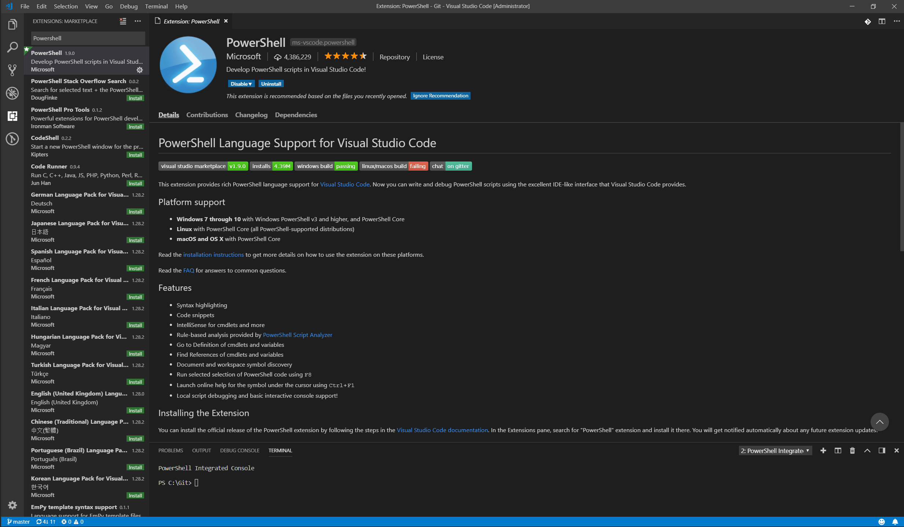

Using Visual Studio Code for PowerShell Development
====

If you are working on Linux and macOS, you cannot use the PowerShell ISE because it is not supported on these platforms.
In this case, you can choose your favorite editor to write PowerShell scripts.
Here we choose Visual Studio Code as a PowerShell editor.

You can use Visual Studio Code on Windows with PowerShell version 5 by using Windows 10 or by installing [Windows Management Framework 5.1 RTM](https://www.microsoft.com/download/details.aspx?id=54616) for down-level Windows OSs (e.g. Windows 8.1, etc.).

Before starting it, please make sure PowerShell exists on your system.
By following the [Installing PowerShell](./README.md#installing-powershell) instructions you can install PowerShell and launch a PowerShell session.

Editing with Visual Studio Code
----
[**1. Installing Visual Studio Code**](https://code.visualstudio.com/Docs/setup/setup-overview)

* **Linux**: follow the installation instructions on the [Running VS Code on Linux](https://code.visualstudio.com/docs/setup/linux) page

* **macOS**: follow the installation instructions on the [Running VS Code on macOS](https://code.visualstudio.com/docs/setup/mac) page

  **NOTE:** On OS X you must install OpenSSL for the PowerShell extension to work correctly.
            The easiest way to accomplish this is to install [Homebrew](http://brew.sh/) and then run `brew install openssl`.
            The PowerShell extension will now be able to load successfully.

* **Windows**: follow the installation instructions on the [Running VS Code on Windows](https://code.visualstudio.com/docs/setup/windows) page


**2. Installing PowerShell Extension**

- Launch the Visual Studio Code app by:
    * **Windows**:      typing **code** in your PowerShell session
    * **Linux**:        typing **code** in your terminal
    * **macOS**:        typing **code** in your terminal

- Launch **Quick Open** by pressing **Ctrl+P** (**Cmd+P** on Mac).
- In Quick Open, type **ext install powershell** and hit **Enter**.
- The **Extensions** view will open on the Side Bar. Select the PowerShell extension from Microsoft.
  You will see something like below:

  

- Click the **Install** button on the PowerShell extension from Microsoft.
- After the install, you will see the **Install** button turns to **Reload**.
  Click on **Reload**.
- After Visual Studio Code has reload, you are ready for editing.

For example, to create a new file, click **File->New**.
To save it, click **File->Save** and then provide a file name, let's say "HelloWorld.ps1".
To close the file, click on "x" next to the file name.
To exit Visual Studio Code, **File->Exit**.

#### Using a specific installed version of PowerShell

If you wish to use a specific installation of PowerShell with Visual Studio Code, you will need to add a new variable to your user settings file.

1. Click **File -> Preferences -> Settings**
2. Two editor panes will appear.
   In the right-most pane (`settings.json`), insert the setting below appropriate for your OS somewhere between the two curly brackets (`{` and `}`) and replace *<version>* with the installed PowerShell version:

  ```json
    // On Windows:
    "powershell.powerShellExePath": "c:/Program Files/PowerShell/<version>/pwsh.exe"

    // On Linux:
    "powershell.powerShellExePath": "/opt/microsoft/powershell/<version>/pwsh"

    // On macOS:
    "powershell.powerShellExePath": "/usr/local/microsoft/powershell/<version>/pwsh"
  ```

3. Replace the setting with the path to the desired PowerShell executable
4. Save the settings file and restart Visual Studio Code

#### Configuration settings for Visual Studio Code

By using the steps in the previous paragraph you can add configuration settings in `settings.json`.

We recommend the following configuration settings for Visual Studio Code:

```json
{
    "csharp.suppressDotnetRestoreNotification": true,
    "editor.renderWhitespace": "all",
    "editor.renderControlCharacters": true,
    "omnisharp.projectLoadTimeout": 120,
    "files.trimTrailingWhitespace": true
}
```

Debugging with Visual Studio Code
----
### No-workspace debugging
As of Visual Studio Code version 1.9 you can debug PowerShell scripts without having to open the folder containing the PowerShell script.
Simply open the PowerShell script file with **File->Open File...**, set a breakpoint on a line (press F9) and then press F5 to start debugging.
You will see the Debug actions pane appear which allows you to break into the debugger, step, resume and stop debugging.

### Workspace debugging
Workspace debugging refers to debugging in the context of a folder that you have opened in Visual Studio Code using **Open Folder...** from the **File** menu.
The folder you open is typically your PowerShell project folder and/or the root of your Git repository.

Even in this mode, you can start debugging the currently selected PowerShell script by simply pressing F5.
However, workspace debugging allows you to define multiple debug configurations other than just debugging the currently open file.
For instance, you can add a configurations to:

* Launch Pester tests in the debugger
* Launch a specific file with arguments in the debugger
* Launch an interactive session in the debugger
* Attach the debugger to a PowerShell host process

Follow these steps to create your debug configuration file:
1. Open the **Debug** view by pressing **Ctrl+Shift+D** (**Cmd+Shift+D** on Mac).
2. Press the **Configure** gear icon in the toolbar.
3. Visual Studio Code will prompt you to **Select Environment**.
Choose **PowerShell**.

   When you do this, Visual Studio Code creates a directory and a file ".vscode\launch.json" in the root of your workspace folder.
   This is where your debug configuration is stored. If your files are in a Git repository, you will typically want to commit the launch.json file.
   The contents of the launch.json file are:

```json
{
    "version": "0.2.0",
    "configurations": [
        {
            "type": "PowerShell",
            "request": "launch",
            "name": "PowerShell Launch (current file)",
            "script": "${file}",
            "args": [],
            "cwd": "${file}"
        },
        {
            "type": "PowerShell",
            "request": "attach",
            "name": "PowerShell Attach to Host Process",
            "processId": "${command.PickPSHostProcess}",
            "runspaceId": 1
        },
        {
            "type": "PowerShell",
            "request": "launch",
            "name": "PowerShell Interactive Session",
            "cwd": "${workspaceRoot}"
        }
    ]
}

```
This represents the common debug scenarios.
However, when you open this file in the editor, you will see an **Add Configuration...** button.
You can press this button to add more PowerShell debug configurations. One handy configuration to add is **PowerShell: Launch Script**.
With this configuration, you can specify a specific file with optional arguments that should be launched whenever you press F5 no matter which file is currently active in the editor.

Once the debug configuration is established, you can select which configuration you want to use during a debug session by selecting one from the debug configuration drop-down in the **Debug** view's toolbar.

There are a few blogs that may be helpful to get you started using PowerShell extension for Visual Studio Code

- Visual Studio Code: [PowerShell Extension][ps-extension]
- [Write and debug PowerShell scripts in Visual Studio Code][debug]
- [Debugging Visual Studio Code Guidance][vscode-guide]
- [Debugging PowerShell in Visual Studio Code][ps-vscode]
- [Get started with PowerShell development in Visual Studio Code][getting-started]
- [Visual Studio Code editing features for PowerShell development – Part 1][editing-part1]
- [Visual Studio Code editing features for PowerShell development – Part 2][editing-part2]
- [Debugging PowerShell script in Visual Studio Code – Part 1][debugging-part1]
- [Debugging PowerShell script in Visual Studio Code – Part 2][debugging-part2]

[ps-extension]:https://blogs.msdn.microsoft.com/cdndevs/2015/12/11/visual-studio-code-powershell-extension/
[debug]:https://blogs.msdn.microsoft.com/powershell/2015/11/16/announcing-powershell-language-support-for-visual-studio-code-and-more/
[vscode-guide]:https://johnpapa.net/debugging-with-visual-studio-code/
[ps-vscode]:https://github.com/PowerShell/vscode-powershell/tree/master/examples
[getting-started]:https://blogs.technet.microsoft.com/heyscriptingguy/2016/12/05/get-started-with-powershell-development-in-visual-studio-code/
[editing-part1]:https://blogs.technet.microsoft.com/heyscriptingguy/2017/01/11/visual-studio-code-editing-features-for-powershell-development-part-1/
[editing-part2]:https://blogs.technet.microsoft.com/heyscriptingguy/2017/01/12/visual-studio-code-editing-features-for-powershell-development-part-2/
[debugging-part1]:https://blogs.technet.microsoft.com/heyscriptingguy/2017/02/06/debugging-powershell-script-in-visual-studio-code-part-1/
[debugging-part2]:https://blogs.technet.microsoft.com/heyscriptingguy/2017/02/13/debugging-powershell-script-in-visual-studio-code-part-2/

PowerShell Extension for Visual Studio Code
----

The PowerShell extension's source code can be found on [GitHub](https://github.com/PowerShell/vscode-powershell).
