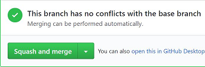
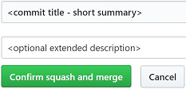
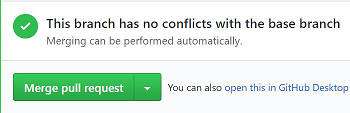
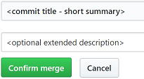

# Maintainer Best Practices

## PR Types

- Feature-work PR: A PR that implements an RFC, which usually involves relatively large set of changes.
- Regular PR: A bug fix or an enhancement change that are not backed by an RFC.

## Review PRs

- Ask the author to reword the PR title based on guidelines in [Contributing](../../.github/CONTRIBUTING.md).
- Ask the author to apply `[feature]` tag to trigger full test builds if it's necessary.
- Label the PR with `Breaking-Change`, `Documentation Needed` and `Area-XXX` as appropriate.
- When labelling a PR with `Review-Committee`, leave a detailed comment to summarize the issue you want the committee to look into.
  It's recommended to include examples to explain/demonstrate behaviors.

## Merge PRs

- Use `Squash and merge` by default to keep clean commit history in Master branch.

  &nbsp;&nbsp;&nbsp;&nbsp;

- Use `Create a merge commit` for feature-work PRs **only if** the commit history of the PR is reasonably clean.
  After using this option, GitHub will make it your default option for merging a PR.
  Do remember to change the default back to `Squash and merge` as it will be useful next time.

  &nbsp;&nbsp;&nbsp;&nbsp;

- Avoid `Rebase and merge` unless you have a strong argument for using it.

- Before clicking `Confirm squash and merge` or `Confirm merge`,
  make sure you run through the following steps:

  1. The commit title should be a short summary of the PR.

     - When merging with the `Squash and merge` option,
       the PR title will be used as the commit title by default.
       **Reword the title as needed** to make sure it makes sense (can be used without change in `CHANGELOG.md`).

     - When merging with the `Create a merge commit` option,
       the default commit title would be `Merge pull request XXX from YYY`.
       **Replace it with a short summary of the PR**, and add the PR number to the end, like `(#1234)`.

  1. The optional extended description is required for feature-work PRs, or regular PRs with breaking changes.
     For other PRs, it's not required but good to have based on the judgement of the maintainer.

     - If a PR introduces breaking changes from the previous stable release,
       make sure you put the tag `[breaking change]` at the first line of the extended description,
       and start the description text from the second line.

  1. Use the present tense and imperative mood for both the commit title and description.
