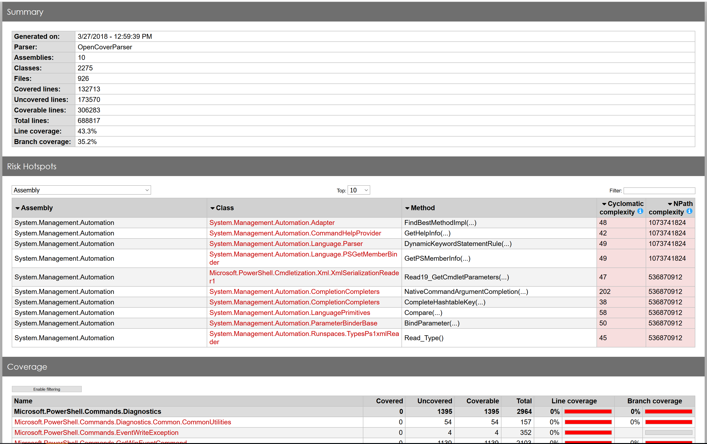
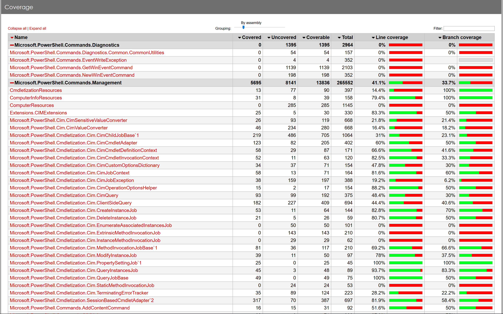

# Getting Code Coverage Analysis for PowerShell

**Note: Code coverage is currently only supported on Windows, since we use OpenCover.**

The PowerShell code base is configured to build with code coverage support using [OpenCover].

You can see the testing coverage of the current [`master`] branch build at any time at [codecov.io].

To run test coverage analysis of PowerShell on your own branch/machine,
you will need to take the following steps
(and be aware that running the code coverage analysis can take as long as 8 hours).

## Running tests with code coverage analysis

**First**: Open PowerShell in an **elevated** session.
OpenCover needs elevated privileges to work.

Now, in PowerShell:

```powershell
# Go to your PowerShell build directory root
PS> Set-Location "C:\Path\to\powershell\build\dir"

# Import the PowerShell build module
PS> Import-Module .\build.psm1

# Build PowerShell. You may need to add other flags here like
# -ResGen or -Restore
PS> Start-PSBuild -Configuration CodeCoverage -Clean -PsModuleRestore

# Now ensure Pester is installed
PS> Restore-PSPester

# We also need to build the test executor
PS> Publish-PSTestTools

# Import the OpenCover module
PS> Import-Module $PWD\test\tools\OpenCover

# Install OpenCover to a temporary directory
PS> Install-OpenCover -TargetDirectory $env:TEMP -Force

# Finally, run the tests with code coverage analysis.
# If you want to run only the continuous integration tests,
# add -CIOnly, which will take less time
PS> Invoke-OpenCover -OutputLog coverage.xml -OpenCoverPath $env:TEMP\OpenCover
```

## Examining the code coverage data

Once the code coverage test run is done, you'll want to examine the data:

```powershell
# Collect the coverage data using Get-CodeCoverage from the OpenCover
# module that was imported above. This operation is generally expensive
# to compute, so worth storing in a variable
PS> $coverageData = Get-CodeCoverage .\coverage.xml

# Take a look at a summary of the results
PS> $coverageData.CoverageSummary

NumSequencePoints       : 298237
VisitedSequencePoints   : 125949
NumBranchPoints         : 101477
VisitedBranchPoints     : 39389
SequenceCoverage        : 42.23
BranchCoverage          : 38.82
MaxCyclomaticComplexity : 393
MinCyclomaticComplexity : 1
VisitedClasses          : 1990
NumClasses              : 3187
VisitedMethods          : 15115
NumMethods              : 32517

# You can also view results by assembly
PS> $coverageData.Assembly | Format-Table AssemblyName,Branch,Sequence

AssemblyName                              Branch Sequence
------------                              ------ --------
pwsh                                      100    100
Microsoft.PowerShell.ConsoleHost          21.58  23.32
System.Management.Automation              41.22  45.01
Microsoft.PowerShell.CoreCLR.Eventing     1.88   2.03
Microsoft.PowerShell.Security             17.32  20.09
Microsoft.PowerShell.Commands.Utility     20.14  21.39
Microsoft.PowerShell.Commands.Management  43.05  43.39
Microsoft.WSMan.Management                52.58  56.98
Microsoft.WSMan.Runtime                   80.95  80.33
Microsoft.PowerShell.Commands.Diagnostics 0      0
```

If you have made changes to tests or code
and run a second code coverage run,
you can also compare code coverage results:

```powershell
PS> $cov1 = Get-CodeCoverage ./coverage1.xml
PS> $cov2 = Get-CodeCoverage ./coverage2.xml
PS> Compare-CodeCoverage -Run1 $cov1 -Run2 $cov2

AssemblyName                              Sequence SequenceDelta Branch BranchDelta
------------                              -------- ------------- ------ -----------
Microsoft.PowerShell.Security                20.09        -30.12  17.32      -31.63
Microsoft.PowerShell.Commands.Management     43.39          9.10  43.05       11.59
System.Management.Automation                 45.04        -10.63  41.23      -11.07
Microsoft.PowerShell.Commands.Utility        21.39        -47.22  20.14      -46.47
Microsoft.PowerShell.Commands.Diagnostics        0        -51.91      0      -48.62
Microsoft.PowerShell.ConsoleHost             23.32        -22.28  21.58      -22.47
pwsh                                           100          0.00    100        0.00
Microsoft.WSMan.Management                   57.73         48.23  53.02       43.22
Microsoft.WSMan.Runtime                      80.33        -19.67  80.95      -19.05
Microsoft.PowerShell.CoreCLR.Eventing         2.03        -32.74   1.88      -26.01
```

To get file-specific coverage data,
you can use `Compare-FileCoverage`:

```powershell
PS> Compare-FileCoverage -ReferenceCoverage $cov2 -DifferenceCoverage $cov1 -FileName LanguagePrimitives.cs

FileName              ReferenceCoverage DifferenceCoverage CoverageDelta
--------              ----------------- ------------------ -------------
LanguagePrimitives.cs 53.68             69.03              15.34
```

You can see more ways to use `Compare-CodeCoverage` and `Compare-FileCoverage`
by running:

```powershell
PS> Get-Help Compare-CodeCoverage -Full
# Or
PS> Get-Help Compare-FileCoverage -Full
```

## Visualizing code coverage

For a more detailed, graphical representation of the code coverage results,
you can use the ReportGenerator package.
This generates an HTML report of the coverage from the XML file
and will provide much more detail about the coverage analysis.
The package is available on [NuGet],
and you can install and run it as follows:

```powershell
# Install ReportGenerator
PS> Find-Package ReportGenerator `
>> -ProviderName Nuget `
>> -Source "https://nuget.org/api/v2" `
>> | Install-Package -Scope CurrentUser

# Get the ReportGenerator executable path
# Make sure use the appropriate version number in the path
$ReportGenExe = "$HOME\AppData\Local\PackageManagement\NuGet\Packages\ReportGenerator.<version>\tools\ReportGenerator.exe"

# Run ReportGenerator
& $ReportGenExe -report:coverage.xml -targetdir:C:\temp\Coverage

# Finally, open the report in your browser
Invoke-Item C:\temp\Coverage\index.htm
```

This should open a screen in the browser like this:


The main report, which is below the summary and risk hot spots, has
a filter functionality as well (when "Enable Filtering" is clicked on):


[OpenCover]: https://github.com/OpenCover/opencover
[codecov.io]: https://codecov.io
[`master`]: https://github.com/PowerShell/PowerShell
[NuGet]: https://nuget.org/packages/ReportGenerator
