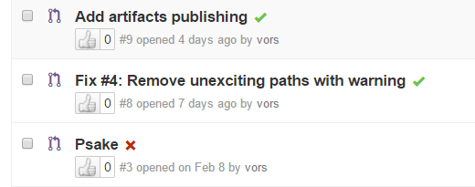

# Testing Guidelines

Testing is a critical and required part of the PowerShell project.

The Microsoft PowerShell team created nearly 100,000 tests over the last 12 years which we run as part of the release process for Windows PowerShell.
Having all of those tests available for the initial release of PowerShell was not feasible,
and we have targeted those tests which we believe will provide us the ability to catch regressions in the areas which have had the largest changes for PowerShell.
It is our intent to continue to release more and more of our tests until we have the coverage we need.

For creating new tests, please review the [documents](https://github.com/PowerShell/PowerShell/tree/master/docs/testing-guidelines) on how to create tests for PowerShell.
There is a best practices document for [writing Pester tests](https://github.com/PowerShell/PowerShell/tree/master/docs/testing-guidelines/WritingPesterTests.md).
When adding new tests, place them in the directories as [outlined below](#test-layout).

## CI System

We use [Azure DevOps](https://azure.microsoft.com/en-us/solutions/devops) as a continuous integration (CI) system for Windows
and non-Windows platforms.

In the `README.md` at the top of the repository, you can see Azure CI badge.
It indicates the last build status of `master` branch.
Hopefully, it's green:


This badge is **clickable**; you can open corresponding build page with logs, artifacts, and tests results.
From there you can easily navigate to the build history.

### Getting CI Results

CI System builds and runs tests on every pull request and provides quick feedback about it.



These green check boxes and red crosses are **clickable** as well.
They will bring you to the corresponding page with details.

## Test Frameworks

### Pester

Our script-based test framework is [Pester](https://github.com/Pester/Pester).
This is the framework which we are using internally at Microsoft for new script-based tests,
and a large number of the tests which are part of the PowerShell project have been migrated from that test base.
Pester tests can be used to test most of PowerShell behavior (even some API operations can easily be tested in Pester).

Substantial changes were required, to get Pester executing on non-Windows systems.
These changes are not yet in the official Pester code base.
Some features of Pester may not be available or may have incorrect behavior.
Please make sure to create issues in [PowerShell/PowerShell](https://github.com/PowerShell/PowerShell/issues) (not Pester) for anything that you find.

#### Test Tags

The Pester framework allows `Describe` blocks to be tagged, and our CI system relies on those tags to invoke our tests.

One of the following tags must be used:

* `CI` - this tag indicates that the tests in the `Describe` block will be executed as part of the CI/PR process
* `Scenario` - this tag indicates a larger scale test interacting with multiple areas of functionality and/or remote resources, these tests are also run daily.
* `Feature` - tests with this tag will not be executed as part of the CI/PR process,
  but they will be executed on a daily basis as part of a `cron` driven build.
  They indicate that the test will be validating more behavior,
  or will be using remote network resources (ex: package management tests)

Additionally, the tag:

* `SLOW` indicates that the test takes a somewhat longer time to execute (97% of our `CI` tests take 100ms or less), a test which takes longer than 1 second should be considered as a candidate for being tagged `Slow`

#### Requesting additional tests for a PR

In our CI systems, we normally run only run tests tagged with `CI`.
If in the first line of the last (most recent) commit description you add `[Feature]`,
we will ensure that we will also run the tests tagged with `Feature`.
When you would want to do this:

- You have added or changed a `Feature` test.
- A maintainer asks you to run the `Feature` tests.
- Based on experience, you are confident that a maintainer will ask you to run the `Feature` tests.

#### Validating packaging changes for a PR

By default, our CI system does a build and run tests for a PR and does not exercise code to create a package.
If your PR includes changes to packaging, you can have the CI system exercise the packaging code by
using `[Package]` as the first line in the commit message.
When you would want to do this:

- You made change to PowerShell Core packaging
- A maintainer asks you to run as `[Package]`

### xUnit

For those tests which are not easily run via Pester, we have decided to use [xUnit](https://xunit.github.io/) as the test framework.
Currently, we have a minuscule number of tests which are run by using xUnit.

## Running tests outside of CI

When working on new features or fixes, it is natural to want to run those tests locally before making a PR.
Three helper functions are part of the build.psm1 module to help with that:

* `Start-PSPester` will execute all Pester tests which are run by the CI system
* `Start-PSxUnit` will execute the available xUnit tests run by the CI system

Our CI system runs these as well; there should be no difference between running these on your dev system, versus in CI.

When running tests in this way, be sure that you have started PowerShell with `-noprofile` as some tests will fail if the
environment is not the default or has any customization.

For example, to run all the Pester tests for CI (assuming you are at the root of the PowerShell repo):

```PowerShell
Import-Module ./build.psm1
Start-PSPester
```

If you wish to run specific tests, that is possible as well:

```PowerShell
Start-PSPester -Path test/powershell/engine/Api
```

Or a specific Pester test file:

```PowerShell
Start-PSPester -Path test/powershell/engine/Api/XmlAdapter.Tests.ps1
```

### What happens after your PR?

When your PR has successfully passed the CI test gates, your changes will be used to create PowerShell binaries which can be run
in Microsoft's internal test frameworks.
The tests that you created for your change and the library of historical tests will be run to determine if any regressions are present.
If these tests find regressions, you'll be notified that your PR is not ready, and provided with enough information to investigate why the failure happened.

## Test Layout

We have taken a functional approach to the layout of our Pester tests and you should place new tests in their appropriate location.
If you are making a fix to a cmdlet in a module, the test belongs in the module directory.
If you are unsure, you can make it part of your PR, or create an issue.

The current layout of tests is:

* test/powershell/engine
* test/powershell/engine/Api
* test/powershell/engine/Basic
* test/powershell/engine/ETS
* test/powershell/engine/Help
* test/powershell/engine/Logging
* test/powershell/engine/Module
* test/powershell/engine/ParameterBinding
* test/powershell/engine/Remoting
* test/powershell/engine/Runspace
* test/powershell/engine/Logging/MessageAnalyzer
* test/powershell/Host
* test/powershell/Host/ConsoleHost
* test/powershell/Host/TabCompletion
* test/powershell/Language
* test/powershell/Modules
* test/powershell/Provider
* test/powershell/SDK
* test/powershell/Security
* test/powershell/Language/Classes
* test/powershell/Language/Interop
* test/powershell/Language/Operators
* test/powershell/Language/Parser
* test/powershell/Language/Interop/DotNet
* test/powershell/Language/Scripting
* test/powershell/Language/Scripting/Debugging
* test/powershell/Language/Scripting/NativeExecution
* test/powershell/Modules/Microsoft.PowerShell.Archive
* test/powershell/Modules/Microsoft.PowerShell.Core
* test/powershell/Modules/Microsoft.PowerShell.Diagnostics
* test/powershell/Modules/Microsoft.PowerShell.Management
* test/powershell/Modules/Microsoft.PowerShell.Security
* test/powershell/Modules/Microsoft.PowerShell.Utility
* test/powershell/Modules/PSReadLine
